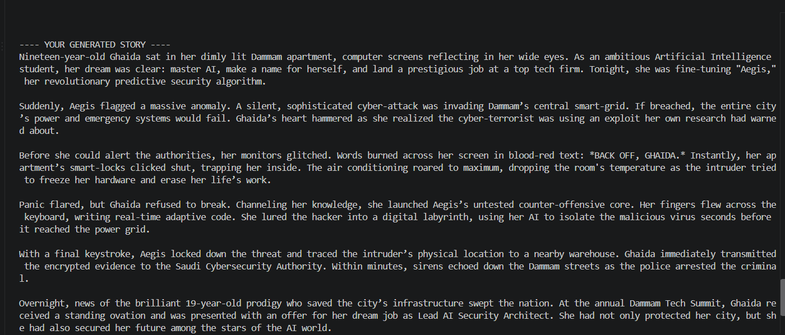

# AI Story Generator 📖

This is my first generative AI project, built as part of my journey learning Prompt Engineering in my AI major. The idea started with a simple question: what if a story wasn't written just once, but regenerated every time based on the reader's own choices?


## What it does

This tool asks the user 6 questions, then generates a short, unique story based on their answers using the Gemini API. No two stories are ever the same, even if the same person runs it twice.

The questions:
- The main character's name
- Story type
- Location
- The main character's age
- The character's goal
- The type of ending they want

The answers are automatically turned into a structured prompt, which is passed to a generative AI model. The model returns a complete story (250–350 words, divided into 5–7 paragraphs) with a clear beginning, main events, and ending — built entirely around the user's choices.

## Example

**Input:**
```text
Character's name: Ghaida
Story type: Thriller
Location: Dammam
Character's age: 19
Character's goal: succeed in her AI major, become well-known in the field, and get hired at an excellent job
Ending: Happy

**Output:**



## Tech Stack

- **Python** — core programming language
- **Google Gemini API** — the generative model that writes the story
- **google-generativeai** — Python library used to call the Gemini API
- **python-dotenv** — keeps the API key secure and out of the source code

## How to Run It

1. Clone the project and open its folder
2. Install the dependencies:
   ```bash
   pip install -r requirements.txt
   ```
3. Get a free API key from [Google AI Studio](https://aistudio.google.com)
4. Create a `.env` file in the project folder and add:
   ```
   GOOGLE_API_KEY=your_key_here
   ```
5. Run the program:
   ```bash
   python main.py
   ```
   ```bash
   python main.py
   ```

## Why I Built This
## Why I Built This

As an AI major, it was important to me not to stop at just the theory. I wanted to see how a concept like Prompt Engineering could turn into something real that anyone could use and see a tangible result from.

This is my first project of its kind, and I ran into real challenges along the way (like access issues with some commercial models). I learned to research alternatives, read documentation, and implement things step by step on my own. For me, the real value isn't just in the final code — it's in the process that got me there.

## Future Improvements

- A simple graphical interface instead of terminal-based interaction
- Saving generated stories to a text file or a lightweight database
- A "regenerate" option in case the user doesn't like the first story
- Support for generating stories in multiple languages (Arabic/English)

---
## Future Improvements

- A simple graphical interface instead of terminal-based interaction
- Saving generated stories to a text file or a lightweight database
- A "regenerate" option in case the user doesn't like the first story
- Support for generating stories in multiple languages (Arabic/English)

---

Built by Ghaidaa Alzahrani, AI student at Imam Abdulrahman Bin Faisal University.

